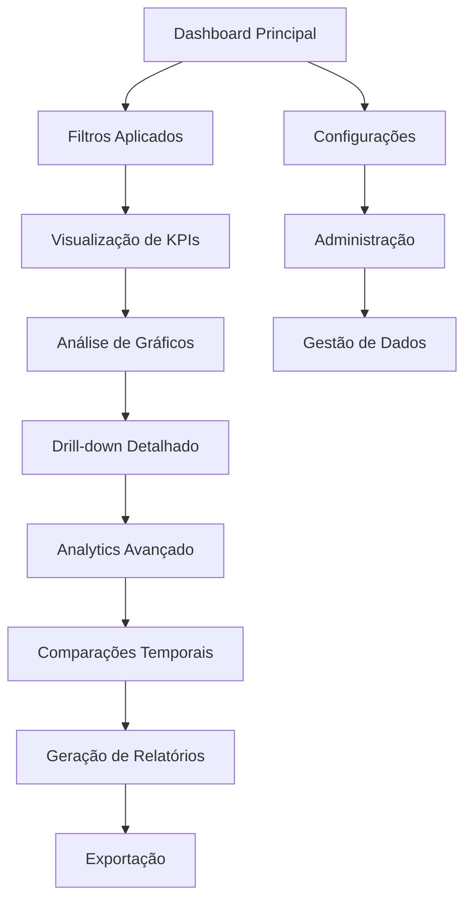

# Dashboard Financeiro Enterprise - DRE Analytics

## 1. Visão Geral do Produto

Dashboard financeiro de nível enterprise focado na análise de DRE (Demonstração do Resultado do Exercício) com funcionalidades avançadas de Business Intelligence. Destinado a grandes empresas com múltiplas entidades e cenários de análise (Real, Orçado, Forecast).

O produto resolve a necessidade de análise financeira consolidada e comparativa, permitindo que gestores e analistas financeiros visualizem performance, identifiquem tendências e tomem decisões estratégicas baseadas em dados.

Objetivo: Fornecer uma plataforma robusta e performática para análise financeira corporativa com visualizações ricas e insights acionáveis.

## 2. Funcionalidades Principais

### 2.1 Papéis de Usuário

| Papel | Método de Registro | Permissões Principais |
|-------|-------------------|----------------------|
| Analista Financeiro | Login corporativo SSO | Visualizar dashboards, gerar relatórios, filtrar dados |
| Gestor Financeiro | Login corporativo SSO | Todas as permissões do analista + configurar alertas e metas |
| Administrador | Convite interno | Gerenciar usuários, configurar entidades, administrar sistema |

### 2.2 Módulos de Funcionalidades

Nossa aplicação de dashboard financeiro consiste nas seguintes páginas principais:

1. **Dashboard Principal**: KPI cards, gráficos interativos, filtros dinâmicos, comparações temporais
2. **Analytics Avançado**: análises detalhadas, drill-down hierárquico, tendências e projeções
3. **Relatórios**: geração e exportação de relatórios customizados (PDF, Excel, CSV)
4. **Administração**: gestão de entidades, cenários, contas contábeis e usuários
5. **Configurações**: preferências de usuário, temas, alertas e notificações

### 2.3 Detalhes das Páginas

| Nome da Página | Nome do Módulo | Descrição da Funcionalidade |
|----------------|----------------|-----------------------------|
| Dashboard Principal | KPI Cards | Exibir métricas principais (Receita Líquida, Lucro Bruto, EBITDA, Margens) com sparklines, comparações e alertas de meta |
| Dashboard Principal | Gráficos Interativos | Renderizar Waterfall Chart para DRE, Donut Charts com drill-down, Area Charts para tendências, Sparklines para indicadores |
| Dashboard Principal | Filtros Dinâmicos | Filtrar por entidade, cenário (Real/Orçado/Forecast), período, com persistência de estado |
| Dashboard Principal | Comparações Temporais | Comparar mês vs. mês, ano vs. ano, com cálculo de variações absolutas e percentuais |
| Analytics Avançado | Drill-down Hierárquico | Navegar pela estrutura hierárquica de contas (níveis 1-3) com expansão/colapso |
| Analytics Avançado | Análise de Variância | Calcular e visualizar variações entre cenários (Real vs. Orçado vs. Forecast) |
| Analytics Avançado | Projeções e Tendências | Gerar projeções baseadas em dados históricos e tendências identificadas |
| Relatórios | Geração de Relatórios | Criar relatórios customizados com filtros aplicados e visualizações selecionadas |
| Relatórios | Exportação Multi-formato | Exportar dados em PDF, Excel, CSV com formatação preservada |
| Relatórios | Agendamento | Agendar geração automática de relatórios com envio por email |
| Administração | Gestão de Entidades | Criar, editar e gerenciar entidades empresariais (Empresa A, B, Consolidado) |
| Administração | Configuração de Contas | Definir plano de contas com hierarquia, natureza e ordenação |
| Administração | Gestão de Usuários | Administrar permissões, papéis e acessos dos usuários |
| Configurações | Preferências de Usuário | Configurar tema (dark/light), idioma, formato de números e moeda |
| Configurações | Alertas e Notificações | Definir alertas para metas, variações significativas e atualizações de dados |

## 3. Processo Principal

**Fluxo do Analista Financeiro:**
O usuário acessa o dashboard principal, aplica filtros de entidade e período desejados, visualiza KPIs e gráficos, realiza drill-down para análises detalhadas, compara cenários e períodos, e gera relatórios para compartilhamento.

**Fluxo do Gestor Financeiro:**
Além do fluxo do analista, o gestor configura metas e alertas, analisa variações significativas, revisa projeções e tendências, e toma decisões estratégicas baseadas nos insights obtidos.

**Fluxo do Administrador:**
Gerencia configurações do sistema, adiciona/remove entidades e usuários, configura plano de contas, monitora performance do sistema e garante integridade dos dados.

## 4. Design da Interface do Usuário

### 4.1 Estilo de Design

- **Cores Primárias**: Azul corporativo (#1e40af), Cinza neutro (#64748b)
- **Cores Secundárias**: Verde para valores positivos (#059669), Vermelho para negativos (#dc2626)
- **Estilo de Botões**: Arredondados com sombras sutis, estados hover e focus bem definidos
- **Tipografia**: Inter para interface, números tabulares para dados financeiros, hierarquia clara (h1: 2xl, h2: xl, h3: lg)
- **Layout**: Grid responsivo baseado em cards, navegação superior fixa, sidebar colapsável
- **Ícones**: Lucide React com estilo outline, tamanho consistente (16px, 20px, 24px)

### 4.2 Visão Geral do Design das Páginas

| Nome da Página | Nome do Módulo | Elementos de UI |
|----------------|----------------|----------------|
| Dashboard Principal | KPI Cards | Cards com fundo branco/dark, bordas sutis, ícones coloridos, sparklines integrados, tipografia tabular para números |
| Dashboard Principal | Gráficos | Containers com padding consistente, paleta de cores corporativa, tooltips informativos, legendas interativas |
| Dashboard Principal | Filtros | Dropdowns com search, date pickers, chips para seleções múltiplas, botão de reset |
| Analytics Avançado | Tabela Hierárquica | Estrutura em árvore expansível, indentação visual, ícones de expand/collapse, zebra striping |
| Analytics Avançado | Gráficos Avançados | Waterfall charts com cores diferenciadas, drill-down interativo, zoom e pan |
| Relatórios | Formulário de Configuração | Layout em duas colunas, preview em tempo real, validação visual, botões de ação destacados |
| Administração | Formulários de Gestão | Layout estruturado, validação inline, feedback visual, modais para confirmações |
| Configurações | Painel de Preferências | Toggle switches, sliders, color pickers, preview instantâneo das mudanças |

### 4.3 Responsividade

**Mobile (< 768px)**: Layout em coluna única, navegação por tabs na parte inferior, KPI cards empilhados, gráficos otimizados para toque, filtros em modal.

**Tablet (768px - 1024px)**: Grid 2×2 para KPI cards, sidebar colapsável, gráficos com tamanho médio, navegação híbrida.

**Desktop (1024px - 1440px)**: Grid completo 4×2, sidebar fixa, gráficos em tamanho padrão, todas as funcionalidades visíveis.

**4K (> 1440px)**: Aproveitamento total da largura, grid expandido, gráficos maiores, painéis laterais adicionais para informações contextuais.