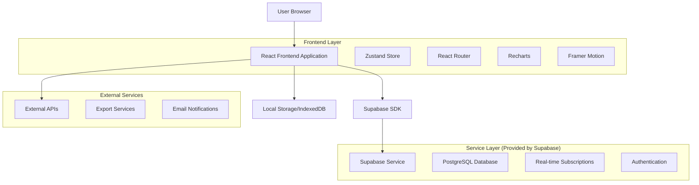
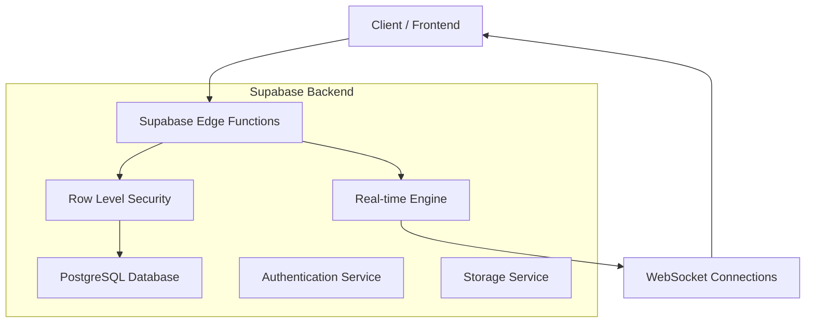
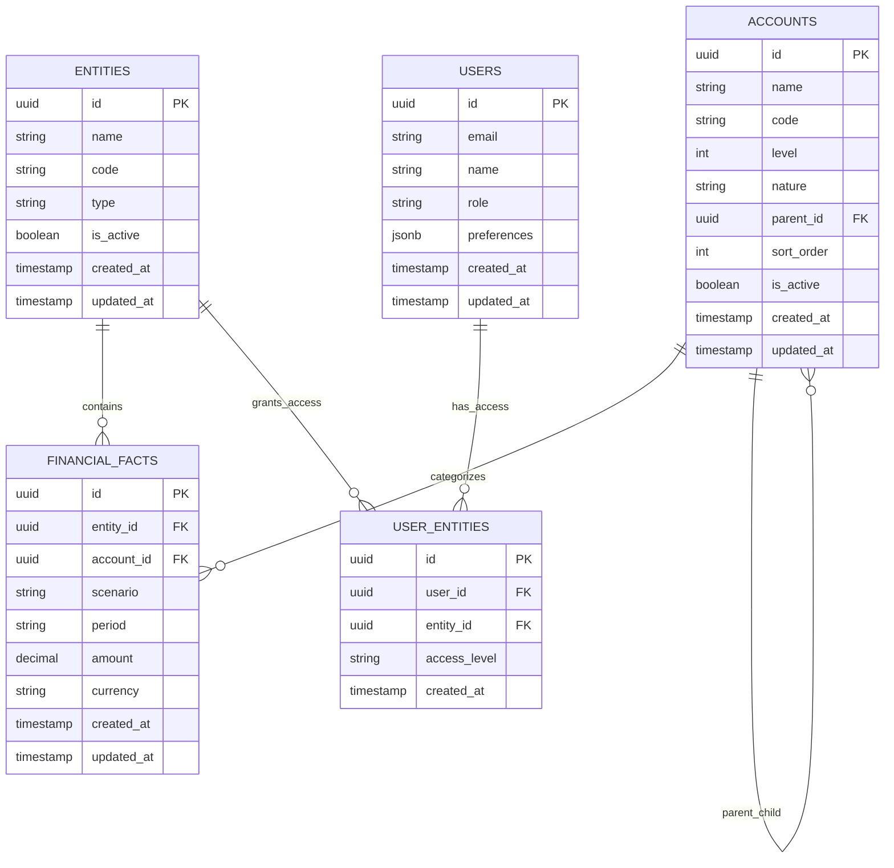

# Arquitetura Técnica - Dashboard Financeiro Enterprise

## 1. Design da Arquitetura



## 2. Descrição das Tecnologias

* **Frontend**: React\@18 + TypeScript + Vite

* **Styling**: Tailwind CSS\@3 + shadcn/ui

* **Charts**: Recharts\@2

* **Animations**: Framer Motion\@10

* **State Management**: Zustand\@4 + Persist

* **Routing**: React Router DOM\@6

* **Forms**: React Hook Form\@7 + Zod\@3

* **Icons**: Lucide React\@0.263

* **Date Utils**: date-fns\@2

* **Backend**: Supabase (PostgreSQL + Auth + Real-time)

## 3. Definições de Rotas

| Rota            | Propósito                                                 |
| --------------- | --------------------------------------------------------- |
| /               | Redirecionamento para /dashboard                          |
| /dashboard      | Dashboard principal com KPIs e gráficos principais        |
| /analytics      | Página de analytics avançado com drill-down e comparações |
| /reports        | Geração e gestão de relatórios customizados               |
| /admin          | Administração de entidades, contas e usuários             |
| /admin/entities | Gestão de entidades empresariais                          |
| /admin/accounts | Configuração do plano de contas                           |
| /admin/users    | Gestão de usuários e permissões                           |
| /settings       | Configurações de usuário e preferências                   |
| /login          | Página de autenticação                                    |
| /profile        | Perfil do usuário e configurações pessoais                |

## 4. Definições de API

### 4.1 Core API

**Autenticação de usuário**

```
POST /auth/v1/token
```

Request:

| Nome do Parâmetro | Tipo   | Obrigatório | Descrição        |
| ----------------- | ------ | ----------- | ---------------- |
| email             | string | true        | Email do usuário |
| password          | string | true        | Senha do usuário |

Response:

| Nome do Parâmetro | Tipo   | Descrição            |
| ----------------- | ------ | -------------------- |
| access\_token     | string | Token de acesso JWT  |
| refresh\_token    | string | Token para renovação |
| user              | object | Dados do usuário     |

**Buscar dados financeiros**

```
GET /rest/v1/financial_facts
```

Request:

| Nome do Parâmetro | Tipo      | Obrigatório | Descrição                        |
| ----------------- | --------- | ----------- | -------------------------------- |
| entity\_id        | string    | false       | ID da entidade                   |
| scenario          | string    | false       | Cenário (real, budget, forecast) |
| period\_start     | string    | false       | Data início (YYYY-MM)            |
| period\_end       | string    | false       | Data fim (YYYY-MM)               |
| account\_ids      | string\[] | false       | IDs das contas                   |

Response:

| Nome do Parâmetro | Tipo             | Descrição                  |
| ----------------- | ---------------- | -------------------------- |
| data              | FinancialFact\[] | Array de fatos financeiros |
| count             | number           | Total de registros         |

**Buscar estrutura de contas**

```
GET /rest/v1/accounts
```

Response:

| Nome do Parâmetro | Tipo       | Descrição                    |
| ----------------- | ---------- | ---------------------------- |
| data              | Account\[] | Array de contas hierárquicas |

## 5. Arquitetura do Servidor



## 6. Modelo de Dados

### 6.1 Definição do Modelo de Dados



### 6.2 Linguagem de Definição de Dados

**Tabela de Entidades (entities)**

```sql
-- Criar tabela
CREATE TABLE entities (
    id UUID PRIMARY KEY DEFAULT gen_random_uuid(),
    name VARCHAR(255) NOT NULL,
    code VARCHAR(50) UNIQUE NOT NULL,
    type VARCHAR(50) DEFAULT 'subsidiary' CHECK (type IN ('subsidiary', 'consolidated', 'division')),
    is_active BOOLEAN DEFAULT true,
    created_at TIMESTAMP WITH TIME ZONE DEFAULT NOW(),
    updated_at TIMESTAMP WITH TIME ZONE DEFAULT NOW()
);

-- Criar índices
CREATE INDEX idx_entities_code ON entities(code);
CREATE INDEX idx_entities_type ON entities(type);
CREATE INDEX idx_entities_active ON entities(is_active);

-- Dados iniciais
INSERT INTO entities (name, code, type) VALUES
('Empresa A', 'EMPA', 'subsidiary'),
('Empresa B', 'EMPB', 'subsidiary'),
('Consolidado', 'CONS', 'consolidated');
```

**Tabela de Contas (accounts)**

```sql
-- Criar tabela
CREATE TABLE accounts (
    id UUID PRIMARY KEY DEFAULT gen_random_uuid(),
    name VARCHAR(255) NOT NULL,
    code VARCHAR(50) UNIQUE NOT NULL,
    level INTEGER NOT NULL CHECK (level BETWEEN 1 AND 3),
    nature VARCHAR(50) NOT NULL CHECK (nature IN ('revenue', 'deduction', 'cogs', 'expense', 'subtotal', 'kpi')),
    parent_id UUID REFERENCES accounts(id),
    sort_order INTEGER DEFAULT 0,
    is_active BOOLEAN DEFAULT true,
    created_at TIMESTAMP WITH TIME ZONE DEFAULT NOW(),
    updated_at TIMESTAMP WITH TIME ZONE DEFAULT NOW()
);

-- Criar índices
CREATE INDEX idx_accounts_code ON accounts(code);
CREATE INDEX idx_accounts_level ON accounts(level);
CREATE INDEX idx_accounts_nature ON accounts(nature);
CREATE INDEX idx_accounts_parent ON accounts(parent_id);
CREATE INDEX idx_accounts_sort ON accounts(sort_order);

-- Dados iniciais
INSERT INTO accounts (name, code, level, nature, sort_order) VALUES
('Receita Bruta', 'REC001', 1, 'revenue', 1),
('Deduções da Receita', 'DED001', 1, 'deduction', 2),
('Receita Líquida', 'RLQ001', 1, 'subtotal', 3),
('Custo dos Produtos Vendidos', 'CPV001', 1, 'cogs', 4),
('Lucro Bruto', 'LBR001', 1, 'subtotal', 5),
('Despesas Operacionais', 'DOP001', 1, 'expense', 6),
('EBITDA', 'EBT001', 1, 'kpi', 7);
```

**Tabela de Fatos Financeiros (financial\_facts)**

```sql
-- Criar tabela
CREATE TABLE financial_facts (
    id UUID PRIMARY KEY DEFAULT gen_random_uuid(),
    entity_id UUID NOT NULL REFERENCES entities(id),
    account_id UUID NOT NULL REFERENCES accounts(id),
    scenario VARCHAR(20) NOT NULL CHECK (scenario IN ('real', 'budget', 'forecast')),
    period VARCHAR(7) NOT NULL, -- YYYY-MM format
    amount DECIMAL(15,2) NOT NULL,
    currency VARCHAR(3) DEFAULT 'BRL',
    created_at TIMESTAMP WITH TIME ZONE DEFAULT NOW(),
    updated_at TIMESTAMP WITH TIME ZONE DEFAULT NOW(),
    UNIQUE(entity_id, account_id, scenario, period)
);

-- Criar índices
CREATE INDEX idx_financial_facts_entity ON financial_facts(entity_id);
CREATE INDEX idx_financial_facts_account ON financial_facts(account_id);
CREATE INDEX idx_financial_facts_scenario ON financial_facts(scenario);
CREATE INDEX idx_financial_facts_period ON financial_facts(period);
CREATE INDEX idx_financial_facts_composite ON financial_facts(entity_id, scenario, period);

-- Dados iniciais (exemplo)
INSERT INTO financial_facts (entity_id, account_id, scenario, period, amount) 
SELECT 
    e.id,
    a.id,
    'real',
    '2024-01',
    CASE 
        WHEN a.nature = 'revenue' THEN 1000000 + RANDOM() * 500000
        WHEN a.nature = 'deduction' THEN -(50000 + RANDOM() * 25000)
        WHEN a.nature = 'cogs' THEN -(300000 + RANDOM() * 150000)
        WHEN a.nature = 'expense' THEN -(200000 + RANDOM() * 100000)
        ELSE 0
    END
FROM entities e, accounts a 
WHERE e.type = 'subsidiary' AND a.nature IN ('revenue', 'deduction', 'cogs', 'expense');
```

**Configurações de Segurança (RLS)**

```sql
-- Habilitar RLS
ALTER TABLE entities ENABLE ROW LEVEL SECURITY;
ALTER TABLE accounts ENABLE ROW LEVEL SECURITY;
ALTER TABLE financial_facts ENABLE ROW LEVEL SECURITY;

-- Políticas básicas
CREATE POLICY "Permitir leitura para usuários autenticados" ON entities
    FOR SELECT TO authenticated USING (true);

CREATE POLICY "Permitir leitura para usuários autenticados" ON accounts
    FOR SELECT TO authenticated USING (true);

CREATE POLICY "Permitir leitura para usuários autenticados" ON financial_facts
    FOR SELECT TO authenticated USING (true);

-- Conceder permissões
GRANT SELECT ON entities TO anon;
GRANT SELECT ON accounts TO anon;
GRANT ALL PRIVILEGES ON entities TO authenticated;
GRANT ALL PRIVILEGES ON accounts TO authenticated;
GRANT ALL PRIVILEGES ON financial_
```

